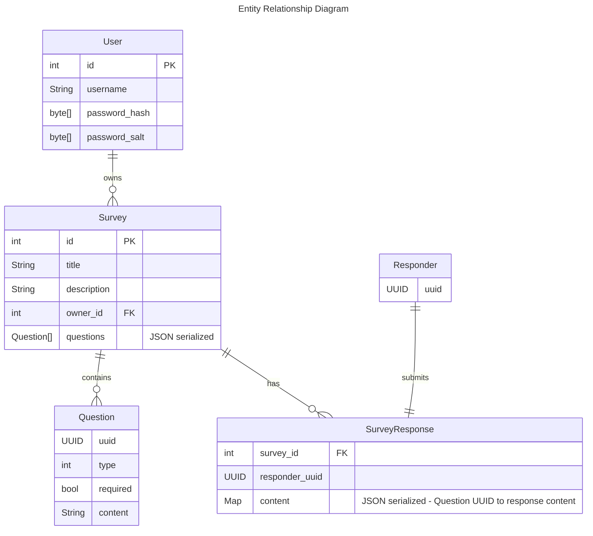

# D6 project architecture and scope proposal

Project: Test/Survey system: In this project, you need to create a test/survey system. Users are in two roles: creators and takers. The creators can create, save, modify a test/survey. The taker can take a test or a survey.

Regardless of which project we do, we will most likely be doing a lot of front end, UI work.

### Goals

- The UI needs to be quick and responsive.
- Survey Responders should be able to edit their responses.

### Technology Stack and Justification

- Frontend: Typescript using Svelte and Vite (maybe SvelteKit?)
  - Svelte does as much as possible at compile time, which means that the code that runs in the browser is as small and as fast as possible without sacrificing developer experience too much.
  - Has good typescript support.
  - React is not lightweight, and it encourages patterns that are frustrating to work with.
- Backend: Rust using the Rocket framework
  - Request input validation is handled by the framework, automatically, guarenteed at compile time.
    - This will save us tons of time when it comes to writing tests.
  - Relatively mature.
- Persistance: Postgres or MongoDB
  - Compatible with Rocket.

We may be able to easily share type definitions between the frontend and backend using [typeshare](https://github.com/1Password/typeshare), which will save time.

### Code Style, Formatting, and Linting

- Rust: rustfmt + clippy
- Typescript: Prettier

# User Stories

### Survey Creator

Wants to create a survey and share it with others to gather responses.

1. Create an account
2. Create a survey
3. Add questions to the survey
4. Survey is saved automatically as it is edited.
5. Publish survey
   1. Survey is no longer editable.
6. Share survey link with others.

### Survey Responder

Wants to take a survey with as little friction as possible.

1. Recieves a survey link
2. Clicks link, opens survey
3. Answers all questions on the survey
   1. As each question is answered, the response is saved.
   2. Modifications to previous answers are saved.
4. Submits survey

# Architecture

In this scenario, the frontend service would take care of rendering any dynamic elements before the page is served.
Each frontend service would be paired with exactly 1 backend service, running on the same machine.

- Users can create and own surveys.

## Data Storage

Tables:
- users
- surveys
- responses

When updating survey responses to the database, it will be safe to aquire a [`ROW EXCLUSIVE` lock on the responses table](https://www.postgresql.org/docs/8.1/explicit-locking.html#LOCKING-ROWS) for and updating by using `SELECT FOR UPDATE`.
Questions intentionally don't have their own table, because each question is only ever associated with one survey. They are stored as json in the surveys table. (This is a tradeoff between performance and simplicity. We could have a separate table for questions, but that would require more complex queries to get the questions for a survey.)

## API

The API will be RESTful, and will use JSON for data serialization. As such, it'll be specified using OpenAPI, enforced by [Optic](https://www.useoptic.com/).

Requests will be validated using [Rocket's request guards](https://rocket.rs/v0.5-rc/guide/requests/#request-guards).

Must be capable of the following:
- Status
  - Health check
- Users
  - User registration
  - User login/logout
  - List User's Surveys
- Surveys
  - Create Survey
  - Edit Survey
    - Must not allow editing of published surveys.
    - Must not accept edits of outdated versions of the survey to prevent data loss.
  - Clear all responses to a survey
- Responses
  - Create a new response
  - Edit an existing response

### Authentication and Authorization

Users will be authenticated using JWTs.
This means that we don't have to store session data in the database.

If a client makes a request with a bad JWT, the server will respond with a 401 Unauthorized. The client must then enter a logged out state.

If a client makes a request with a good JWT, but is trying to access a resource that they don't have authorization to access, the server will respond with a 403 Forbidden.

# Survey Questions

These are the types of questions that we will support:
- Multiple Choice
  - Eg. "Select one"
  - Eg. "Select all that apply"
- Text (single-line or multi-line)
  - Eg. "What is your name?"
  - Eg. "Describe a time when you..."
- Rating
  - Eg. "On a scale of 1-10, How much do you like this?"

# Response UI Behavior

As a responder completes the survey, the partial response should be saved in the browser's local storage.

When a responder submits the survey, the client must obtain a responder UUID from the server in the response. This UUID will be used to identify the responder in the database, and will allow a responder to edit their response after they have submitted it.

- Closing the broswer tab without submitting will prompt the user before exiting.
- At the end of the survey, the user will be provided with a link that allows them to edit their responses.
